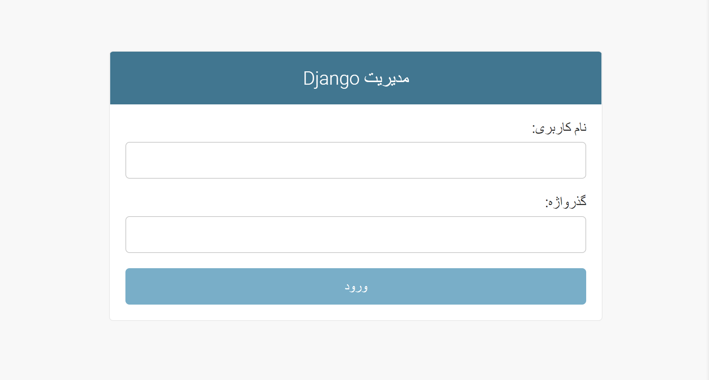
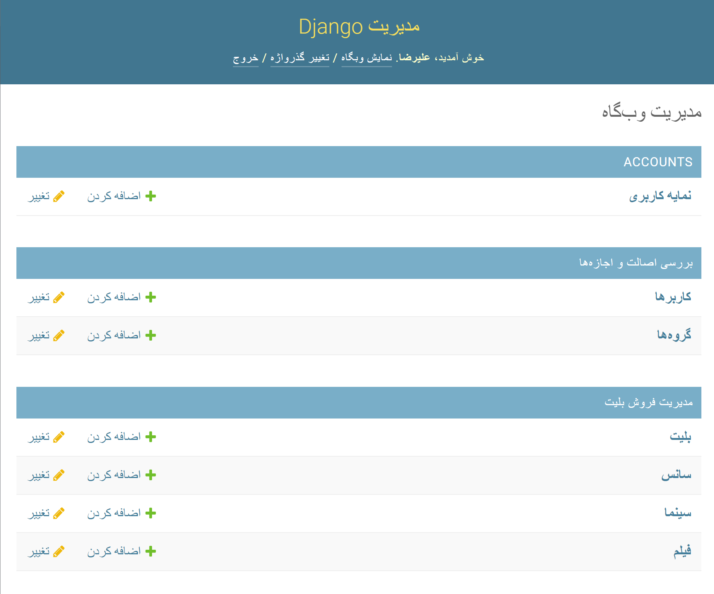

## سناریوی مدیر پروژه

 ادمین | سیستم
 ------------- | -------------
 به دایرکتوری '/admin' پروژه می رود | فرم نام کاربری و رمز عبور را نشان می دهد.
 نام کاربری و رمز عبور را وارد می کند و لاگین می کند. | اعتبارسنجی ها نام کاربری و رمز ورود خود را وارد کرده و اگر مدیر معتبر باشد پنل مدیریت را نشان می دهد
 

 
 ## کنترل های سرپرست سایت

 مدیر می تواند پروفایل کاربر ، بلیط ، زمان نمایش ، سینما و فیلم را ایجاد ، خواندن ، به روز رسانی و حذف کند.
 

